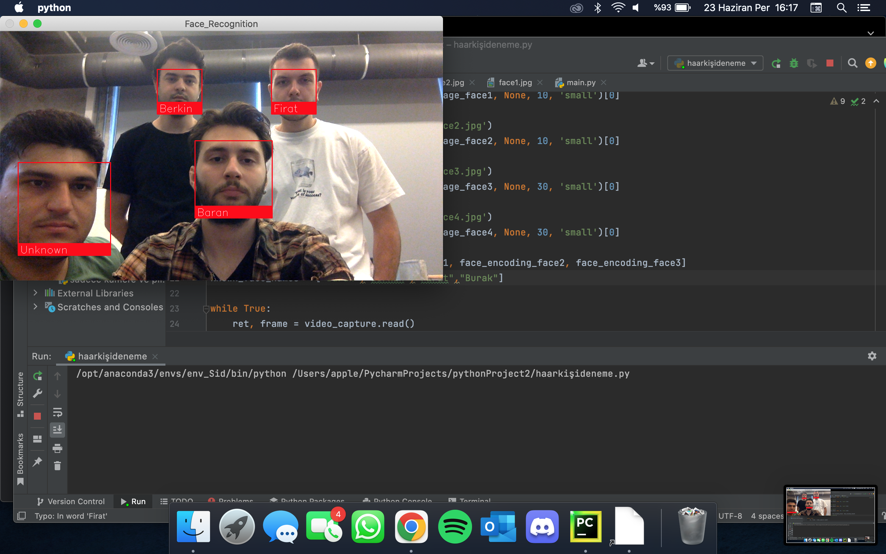
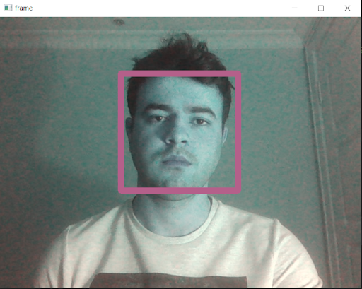

# 🚁 Autonomous Human Tracking Drone

A real-time autonomous human tracking system using **DJI Tello** drone with **face recognition** and **PID control**. The drone identifies specific individuals via facial encoding and autonomously follows them by adjusting yaw and forward/backward movement.


---

## 📸 Demo

<p align="center">
  
  <br>
  <em>Real-time face detection and tracking from drone camera</em>
</p>

<p align="center">
  
  <br>
  <em>Multi-face recognition identifying known individuals</em>
</p>

---

## 📋 Overview

This project combines computer vision and drone control to create an autonomous tracking system that:

- Detects and recognizes faces in real-time using the drone's camera stream
- Identifies known individuals from a pre-loaded face encoding database
- Uses a PID controller to smoothly track the target by adjusting drone yaw and distance
- Maintains optimal distance from the target using face area estimation


**PID Control Loop:**
- **Yaw Control:** `speed_x = Kp * error_x + Kd * (error_x - prev_error)`
- **Forward/Backward:** Based on face bounding box area relative to target range
- **Search Mode:** Clockwise rotation when target is lost

## ✨ Features

- **Face Recognition:** Identifies specific individuals using face_recognition library (dlib-based)
- **PID Tracking:** Smooth and responsive tracking with proportional-derivative control
- **Distance Control:** Maintains optimal distance using face area estimation
- **Search Behavior:** Autonomous clockwise rotation when target is lost
- **Battery Safety:** Pre-flight battery check before takeoff
- **Multi-Face Support:** Can register multiple known faces for identification

## 🛠️ Requirements

### Hardware
- DJI Tello / Tello EDU drone
- Computer with Wi-Fi (to connect to Tello's network)
- Webcam (optional, for testing without drone)

### Software
- Python 3.8+
- See [requirements.txt](requirements.txt) for Python dependencies

## 🚀 Installation

1. **Clone the repository:**
   ```bash
   git clone https://github.com/tonytyler99/VTOL-UAV-PROJECT.git
   cd VTOL-UAV-PROJECT
   ```


2. **Install dependencies:**
   ```bash
   pip install -r requirements.txt
   ```

   > **Note:** `dlib` installation may require CMake. On Ubuntu:
   > ```bash
   > sudo apt-get install cmake libboost-all-dev
   > ```

3. **Add reference face images:**
   
   Place your reference face images in the `images/reference/` folder:
   ```
   images/reference/
   ├── person1.jpg
   └── person2.jpg
   ```

4. **Update configuration:**
   
   Edit `src/config.py` to set your target faces and tracking parameters.

## 📖 Usage

1. **Power on** your DJI Tello drone
2. **Connect** your computer to the Tello's Wi-Fi network
3. **Run the tracker:**

   ```bash
   python src/autonomous_tracking.py
   ```

5. **Controls:**
   - Press `q` to quit and land the drone safely

## ⚙️ Configuration

All tunable parameters are in `src/config.py`:

| Parameter | Default | Description |
|-----------|---------|-------------|
| `FRAME_WIDTH` | 360 | Processing frame width |
| `FRAME_HEIGHT` | 240 | Processing frame height |
| `PID_KP` | 0.4 | Proportional gain |
| `PID_KD` | 0.4 | Derivative gain |
| `FB_RANGE_MIN` | 3000 | Min face area (move forward) |
| `FB_RANGE_MAX` | 5000 | Max face area (move backward) |
| `FB_SPEED` | 25 | Forward/backward speed |
| `SEARCH_SPEED` | 20 | Rotation speed when searching |
| `MIN_BATTERY` | 50 | Minimum battery % for takeoff |


## 🔧 Troubleshooting

| Issue | Solution |
|-------|----------|
| `dlib` install fails | Install CMake: `sudo apt install cmake` |
| Tello not connecting | Ensure you're on Tello's Wi-Fi network |
| Laggy tracking | Reduce `FRAME_WIDTH`/`FRAME_HEIGHT` in config |
| Drone oscillates | Lower `PID_KP` and `PID_KD` values |
| Face not detected | Ensure good lighting and clear face visibility |


## 📄 License

This project is licensed under the MIT License - see the [LICENSE](LICENSE) file for details.

